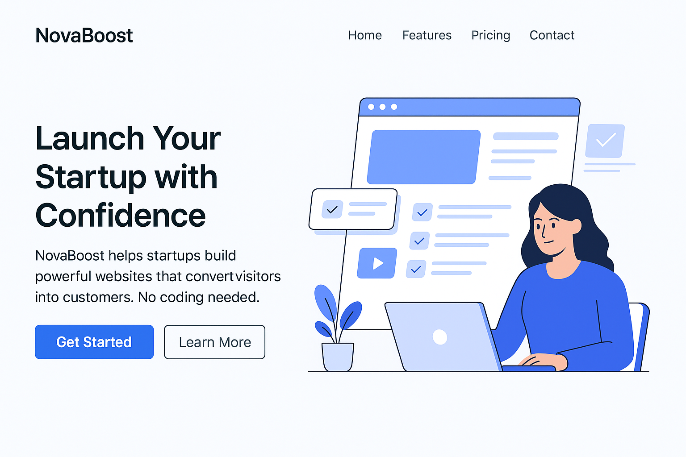

# NovaBoost – Startup Landing Page 🚀

**NovaBoost** is a modern, responsive, and high-converting startup landing page template designed to help you showcase your product or service with style and clarity. Built with clean HTML and CSS, it's perfect for entrepreneurs, SaaS platforms, or any new venture looking to make a bold impression online.

---

## 🌟 Features

- ✅ Fully responsive design
- 🎯 Hero section with CTA
- ⚙️ Features grid with icons
- 💸 Pricing plans with clear call-to-actions
- 📞 Contact form
- 🙌 Testimonials section
- 📂 FAQ (accordion-style) section
- 🌙 Mobile-friendly navigation menu with toggle
- 💅 Custom button styles and hover effects
- 🚫 No frameworks, pure HTML5 & CSS3

---

## 📁 Folder Structure

```
NovaBoost/
│
├── index.html
├── css/
│   └── style.css
├── img/
│   ├── hero-image.png
│   ├── icon-speed.svg
│   ├── icon-customize.svg
│   ├── icon-responsive.svg
│   ├── icon-secure.svg
│   └── favicon.ico
├── js/
│   └── main.js
```

---

## 📸 Screenshot



---

## ⚙️ How to Use

1. Clone or download this repository.
2. Open `index.html` in your browser to preview.
3. Customize content, images, and colors to fit your brand.
4. Deploy to any static hosting service (GitHub Pages, Netlify, Vercel, etc.)

---

## 🔐 License

This template is open-source and free for personal and commercial use. Attribution appreciated but not required.

---

## 🙋‍♂️ Author

Made with ❤️ by [elasrri21]  
Feel free to reach out for feedback or collaboration!

---

## 📌 Tip

Don't forget to update the favicon with your own brand logo in the `img/` folder (`favicon.ico`).
